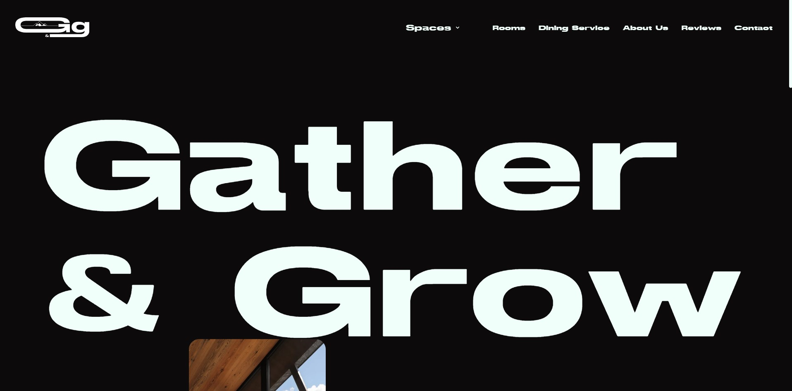

<a name="readme-top"></a>
<!-- PROJECT LOGO -->
<br />
<div align="center">
  <a href="">
    
  </a>

<!-- TABLE OF CONTENTS -->
<details>
  <summary>Table des matières</summary>
  <ol>
    <li><a href="#a-propos-du-projet">À propos du projet</a></li>
    <li><a href="#langagesutilises">langages Utilisés</a></li>
    <li><a href="#installation">Installation</a></li>
    <li><a href="#contact">Contact</a></li>
  </ol>
</details>


<!-- ABOUT THE PROJECT -->
## À propos du projet

Gather & Grow est une plateforme fictive conçue pour la gestion d'espaces de coworking situés dans des zones rurales.

L'objectif principal est de permettre aux utilisateurs de découvrir et réserver des espaces de travail inspirants et bien équipés. Ce projet entièrement frontend met en avant l'utilisation du routing dynamique de Next.js pour organiser les pages et gérer les URL de manière optimisée.

Pour enrichir l'expérience utilisateur, GSAP et Framer Motion ont été intégrés afin de créer des animations dynamiques et des transitions fluides, rendant la navigation captivante et engageante.


## Langages utilisés et autres technologies utilisées


## Installation

1. Clonez le repository de l'application
   ```sh
   git clone https://github.com/AurelieDuynslaeger/gatherandgrow.git
   ```

2. Installez les dépendances
    ```sh
   npm install
   ```
   
3. Lancez le projet
    ```sh
   npm run dev
   ```
  
## Contact

Aurélie D. - [GitHub](https://github.com/AurelieDuynslaeger/)
